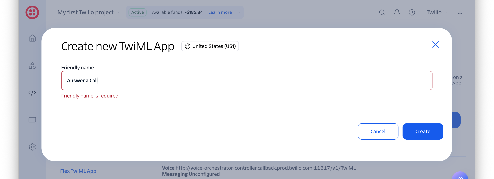
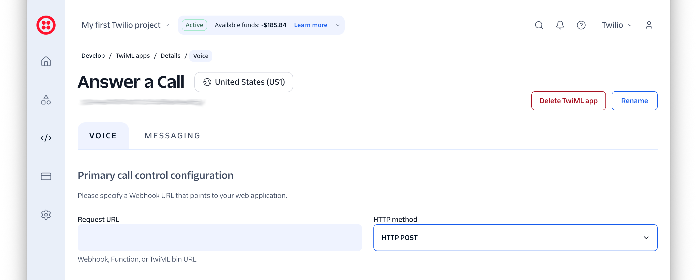
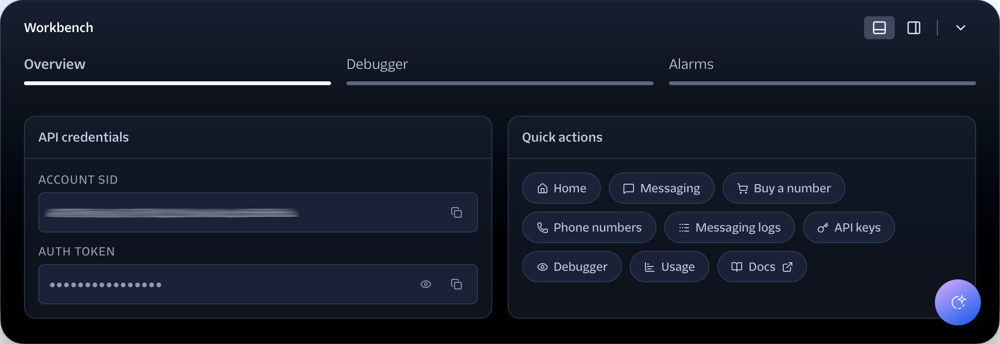

<!-- markdownlint-disable MD013 -->

# Demonstrate how to answer a call, play a welcome greeting, and redirect the caller with TwiML

This is a small, almost skeleton project based on [the Slim Framework][slim-framework]
It has a single route which returns TwiML to answer an incoming call, play a greeting, and redirect the caller to support.

## Prerequisites

You'll need the following to use the application:

- PHP 8.4 or above (ideally)
- [Composer][composer] installed globally
- [ngrok][ngrok] or a similar tool
- A Twilio account (free or paid) with a phone number that supports phone calls and SMS.
  [Sign up for one now][try-twilio] if you don't have one already.
- Your preferred code editor or IDE
- Some terminal experience is helpful, though not required

## Quick Start

### Clone the project

To start using the project, run the following commands, wherever you store your PHP apps, to clone it and change into the cloned directory:

```bash
git clone git@github.com:settermjd/inbound-call-with-text-response.git inbound-call-with-text-response
cd inbound-call-with-text-response
```

### Start the application

Now, start the application by running the following command:

```bash
composer serve
```

> [NOTE]
> In the terminal output, you'll see, that the application will be listening on port 8080 (if available).

### Make the application publicly available

The app needs to be publicly available for Twilio to send webhook requests to it.
To do that, run the following command to have ngrok create a secure tunnel between the public internet and the app.

```bash
ngrok http 8080
```

### Configure your Twilio account

With that done, open [the Twilio Console][twilio-console] in your browser of choice and:

1. Under **Products &amp; Services > Voice > Overview**, click **Set up Voice**
1. In TwiML Apps, click **Create TwiML App**



1. In the **Create new TwiML App** dialog that appears, add a **Friendly name** for the app, such as "Answer a Call", and click **Create**
1. In the **Primary call control configuration** section of the **Voice** tab, set your ngrok Forwarding URL as the value of the **Request URL** field, and leave the accompanying **HTTP method** field set to "HTTP POST"



1. Scroll to the bottom of the page and click **Save**

### Retrieve your Twilio credentials

Then, open [the Twilio Console][twilio-console] in your browser of choice, open the **Workbench** by clicking the black and white arrow in the middle of the bottom of the page, and copy the **Account SID** and **Auth Token** as you can see in the screenshot below.



Then, set those values as the values of `TWILIO_ACCOUNT_SID`, `TWILIO_AUTH_TOKEN`, respectively, in _.env_.

After that, in the left-hand side navigation menu, navigate through **Products &amp; Services > Numbers &amp; senders > Overview**.
There, from the **Phone Numbers** tab, copy a phone number that supports **both** SMS and Voice, and paste it into _.env_ as the value of `TWILIO_PHONE_NUMBER`.

> [NOTE]
> Make sure you copy the [E.164][e164-format] formatted version, not the local version.
> For example: +12345678912.

## Using the application

To use the application, make a phone call to your Twilio phone number.
Enjoy.
🙂

## Contributing

If you want to contribute to the project, whether you have found issues with it or just want to improve it, here's how:

- [Issues][github-issues]: ask questions and submit your feature requests, bug reports, etc
- [Pull requests][github-prs]: send your improvements

## License

[MIT][mit-license]

## Disclaimer

No warranty expressed or implied.
Software is as is.

<!-- Links -->

[composer]: https://getcomposer.org
[e164-format]: https://www.twilio.com/docs/glossary/what-e164
[github-issues]: https://github.com/settermjd/inbound-call-with-text-response/issues
[github-prs]: https://github.com/settermjd/inbound-call-with-text-response/pulls
[mit-license]: http://www.opensource.org/licenses/mit-license.html
[ngrok]: https://ngrok.com
[slim-framework]: https://www.slimframework.com
[try-twilio]: https://twilio.com/try-twilio
[twilio-console]: https://console.twilio.com

<!-- markdownlint-enable MD013 -->
